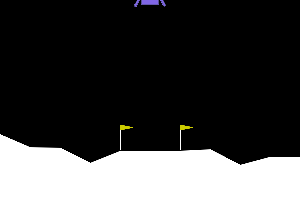
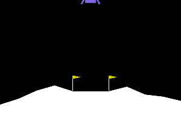
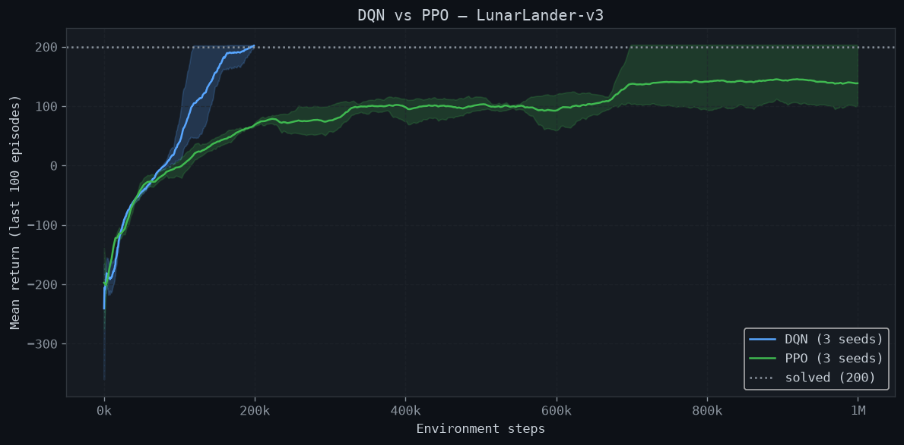
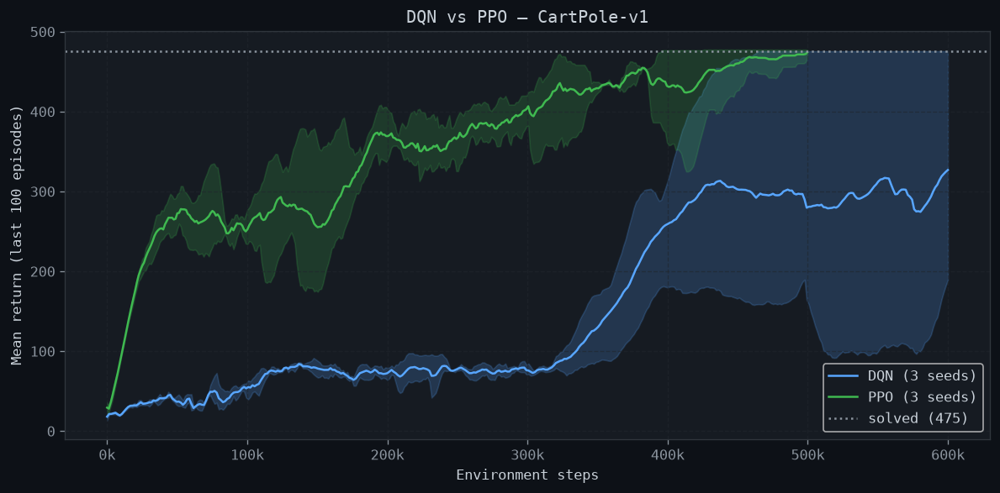

# Reinforcement Learning Agents from Scratch

[](https://github.com/wyplerszymon0-lab/reinforcement-learning-agents/actions/workflows/ci.yml)

DQN and PPO implemented in pure PyTorch, trained on CartPole-v1 and LunarLander-v3.  
No stable-baselines3. No RLlib. Just the math.

| DQN · CartPole | PPO · CartPole | DQN · LunarLander | PPO · LunarLander |
| :---: | :---: | :---: | :---: |
|  |  |  |  |

<sub>Best seed of each, final policy, one fresh episode. Rendered by `scripts/make_report.py`.</sub>

## Results

Every configuration was trained with **3 seeds** and evaluated on 100 fresh episodes
([full per-seed table](results/RESULTS.md)).

| Environment | Algorithm | Solved | Median steps to solve | Greedy eval | Sampled eval |
| :--- | :--- | :---: | ---: | ---: | ---: |
| CartPole-v1 | DQN | 1/3 | 464k | 429.7 ± 104.0 | — |
| CartPole-v1 | PPO | 2/3 | 410k | 500.0 ± 0.0 | 488.6 ± 8.0 |
| LunarLander-v3 | DQN | 3/3 | 163k | 217.5 ± 4.5 | — |
| LunarLander-v3 | PPO | 1/3 | 698k | 146.2 ± 52.1 | 128.7 ± 39.2 |

*Solved* = the trailing 100-episode training return reached the official threshold
(CartPole 475, LunarLander 200); training stops there. *Sampled eval* samples actions
from PPO's policy distribution instead of always taking the most likely one.




<sub>Line: mean over seeds of the trailing 100-episode return. Band: best to worst seed.
A seed that stopped early (solved) is held at its final value.</sub>

**Takeaways**

- **DQN is the clear winner on LunarLander**: all 3 seeds solve it in 118k–199k steps,
  about 4× fewer environment steps than the one PPO seed that got there.
- **PPO dominates CartPole early** (return ~270 after 50k steps, DQN ~40), and its
  greedy policy balances perfectly (500/500) on every seed.
- **DQN on CartPole is the least stable combination**: one seed solves it, the others
  plateau between 300 and 480. Seed-to-seed variance is large for both algorithms,
  which is why single-seed results in RL are not worth much.

### What training revealed

The first full training run exposed three bugs that unit tests had not caught. Each
is fixed and now has a regression test:

1. **Early stopping never stopped anything.** The callback set
   `trainer.total_timesteps = 0`, but the loop had already built its `range(...)`.
   Trainers now check a `stop_training` flag.
2. **PPO barely learned on LunarLander** (−150 after 1M steps). Actor and critic
   shared a trunk, and the value loss (returns squared, ~6,000) produced a gradient
   **~2,000× larger** than the policy's. After global gradient clipping the policy got
   **0.025%** of each step. Fix: separate actor and critic networks, clipped separately.
3. **PPO's "greedy" evaluation was sampling.** `act(training=False)` ignored the flag.

DQN on CartPole also oscillated and collapsed when it took a gradient step on every
environment step (greedy eval 138–170 after 500k steps). Updating every 4 steps
(`train_freq: 4`) made learning monotonic: 310–500.

---


## Algorithms

### Deep Q-Network (DQN)

**Paper:** Mnih et al., *Human-level control through deep reinforcement learning*, Nature 2015  
**Extensions:** Double DQN (van Hasselt et al., 2016), Dueling Networks (Wang et al., 2016)

DQN approximates the optimal action-value function via the Bellman optimality equation:

$$Q^*(s, a) = \mathbb{E}\left[r + \gamma \max_{a'} Q^*(s', a') \,\middle|\, s, a\right]$$

The network is trained to minimize the temporal difference (TD) error:

$$\mathcal{L}(\theta) = \mathbb{E}_{(s,a,r,s') \sim \mathcal{D}}\left[\left(y - Q_\theta(s, a)\right)^2\right]$$

where the target $y$ uses a **frozen target network** $\theta^-$:

$$y = r + \gamma \max_{a'} Q_{\theta^-}(s', a')$$

**Why this works:**
- **Experience replay** breaks temporal correlations in the data stream, enabling stable mini-batch SGD
- **Target network** fixes the non-stationary bootstrap target for $C$ steps, preventing oscillation
- **Double DQN** decouples action *selection* (online net) from *evaluation* (target net), eliminating maximization bias: $y = r + \gamma Q_{\theta^-}(s', \arg\max_{a'} Q_\theta(s', a'))$
- **Dueling architecture** separates $V(s)$ and $A(s,a)$ streams: $Q(s,a) = V(s) + A(s,a) - \frac{1}{|\mathcal{A}|}\sum_{a'} A(s,a')$

**Implementation details:**
- Huber loss (smooth L1) over MSE — bounded gradients prevent early training instability
- Hard target updates every 500–1000 steps
- Linear epsilon decay: $\varepsilon_t = \max(\varepsilon_\text{min},\ \varepsilon_0 - t \cdot \Delta\varepsilon)$
- Gradient clipping at 10.0

---

### Proximal Policy Optimization (PPO)

**Paper:** Schulman et al., *Proximal Policy Optimization Algorithms*, arXiv 2017  
**Prerequisite:** GAE — Schulman et al., *High-Dimensional Continuous Control Using Generalized Advantage Estimation*, ICLR 2016

PPO maximizes a surrogate objective that constrains how much the policy can change in a single update:

$$\mathcal{L}^\text{CLIP}(\theta) = \mathbb{E}_t\left[\min\!\left(r_t(\theta)\,\hat{A}_t,\ \text{clip}(r_t(\theta), 1-\varepsilon, 1+\varepsilon)\,\hat{A}_t\right)\right]$$

where $r_t(\theta) = \frac{\pi_\theta(a_t|s_t)}{\pi_{\theta_\text{old}}(a_t|s_t)}$ is the probability ratio.

Advantages are estimated via **GAE**:

$$\hat{A}_t^{\text{GAE}(\gamma,\lambda)} = \sum_{l=0}^{\infty} (\gamma\lambda)^l\,\delta_{t+l}, \quad \delta_t = r_t + \gamma V(s_{t+1})(1-d_t) - V(s_t)$$

- $\lambda = 1$: Monte Carlo returns (unbiased, high variance)
- $\lambda = 0$: 1-step TD (biased, low variance)  
- $\lambda = 0.95$: empirical sweet spot

**Why this works:**
- The clip $[1-\varepsilon, 1+\varepsilon]$ acts as a first-order trust region: it prevents the policy ratio from moving far from 1 without expensive Hessian computation (unlike TRPO)
- The `min` ensures the objective is a lower bound on performance — we never *gain* from a bad update
- Advantage normalization (batch-level) further reduces gradient variance
- Multiple epochs over the same rollout with mini-batches improve sample utilization while the clip constraint prevents overfitting to old data

**Implementation details:**
- Orthogonal weight initialization (Saxe et al., 2013) — critical for PPO
- Tanh activations (bounded) in actor-critic trunk
- Entropy bonus $-c_2 H[\pi_\theta]$ encourages exploration
- Learning rate annealing: $\alpha_t = \alpha_0 \cdot (1 - t/T)$
- Value function clipping mirrors policy clip

---

--|---|---|---|
| DQN (Double + Dueling) | CartPole-v1 | ~490 | ~15 | ~80k |
| PPO (GAE) | CartPole-v1 | ~500 | ~3 | ~150k |
| DQN (Double + Dueling) | LunarLander-v3 | ~220 | ~40 | ~350k |
| PPO (GAE) | LunarLander-v3 | ~240 | ~25 | ~600k |

*CartPole-v1 solved threshold: 475 · LunarLander-v3 solved threshold: 200*

---

## Project Structure

```
.
├── src/
│   ├── agents/
│   │   ├── base_agent.py       # Abstract agent interface
│   │   ├── networks.py         # DQNNetwork, ActorCriticNetwork, MLP
│   │   ├── dqn.py              # DQN + Double DQN + Dueling
│   │   └── ppo.py              # PPO + GAE + clipped objective
│   ├── environments/
│   │   ├── wrappers.py         # RewardScaling, NormalizeObs, EpisodeMonitor
│   │   └── utils.py            # get_env_dims, set_global_seed
│   ├── training/
│   │   ├── replay_buffer.py    # ReplayBuffer (off-policy), RolloutBuffer (on-policy)
│   │   ├── trainer.py          # DQNTrainer, PPOTrainer with metric logging
│   │   └── callbacks.py        # EarlyStopping, Logging callbacks
│   └── evaluation/
│       ├── evaluator.py        # Greedy evaluation with trajectory collection
│       └── plotting.py         # Training curves, comparisons, distributions
├── tests/                      # 75 pytest tests
├── scripts/
│   ├── train.py                # train one algo/env/seed from config.yaml
│   └── make_report.py          # plots, GIFs and RESULTS.md from all runs
├── notebooks/
│   └── dqn_vs_ppo_comparison.ipynb
├── results/
│   ├── runs/                   # per-seed training logs + evaluations (JSON)
│   ├── models/                 # weights of the best seed per algo/env
│   ├── plots/  gifs/           # generated figures
│   └── RESULTS.md              # generated results table
└── config.yaml                 # all hyperparameters (single source of truth)
```

---

## Quick Start

```bash
# Install
pip install -e ".[dev,notebooks]"

# Run tests
pytest

# Train one configuration (hyperparameters come from config.yaml)
python scripts/train.py --env cartpole --algo ppo --seed 1
python scripts/train.py --env lunarlander --algo dqn --seed 1

# Rebuild plots, GIFs and results/RESULTS.md from every run in results/runs/
python scripts/make_report.py

# Interactive comparison notebook
jupyter notebook notebooks/dqn_vs_ppo_comparison.ipynb
```

---

## Key Design Decisions

**Why Huber loss over MSE for DQN?**  
Early in training, TD errors can be large (the target network is random). MSE squares these errors, producing enormous gradients that destabilize the network. Smooth L1 behaves like MSE for small errors and like L1 for large ones — bounded gradient magnitude.

**Why Tanh activations in PPO but ReLU in DQN?**  
Policy gradient methods are sensitive to the scale of activations flowing into the policy head. Tanh bounds outputs, reducing variance in log-probability estimates. DQN's Q-values don't have a natural scale constraint, and ReLU's lack of saturation improves gradient flow through deeper value networks.

**Why orthogonal initialization?**  
Orthogonal matrices preserve gradient norms during the backward pass. In RL where networks are updated many thousands of times with non-i.i.d. data, this prevents the exploding/vanishing gradients that Glorot/He initialization doesn't guard against long-term.

**Why separate replay strategies?**  
DQN is explicitly off-policy: the Bellman backup is valid regardless of the behavior policy. PPO's surrogate objective is derived assuming data was collected under the current policy — using a replay buffer would invalidate the importance ratio $r_t(\theta)$, making the gradient estimate biased.

---

## Hyperparameter Sensitivity

The most impactful hyperparameters by algorithm:

**DQN:**
1. `epsilon_decay_steps` — too fast → insufficient exploration; too slow → slow convergence
2. `target_update_freq` — too frequent → unstable; too infrequent → slow credit assignment
3. `buffer_capacity` — must be large enough that samples are approximately i.i.d.

**PPO:**
1. `clip_coef` (ε) — controls the trust region size; 0.1–0.3 is the empirical range
2. `gae_lambda` — bias/variance tradeoff; 0.95 is nearly universally good
3. `num_steps` — rollout length; longer → more on-policy data but slower updates

---

## References

1. Mnih et al. (2015). *Human-level control through deep reinforcement learning.* Nature.
2. van Hasselt et al. (2016). *Deep Reinforcement Learning with Double Q-learning.* AAAI.
3. Wang et al. (2016). *Dueling Network Architectures for Deep Reinforcement Learning.* ICML.
4. Schulman et al. (2015). *High-Dimensional Continuous Control Using Generalized Advantage Estimation.* ICLR.
5. Schulman et al. (2017). *Proximal Policy Optimization Algorithms.* arXiv:1707.06347.
6. Saxe et al. (2013). *Exact solutions to the nonlinear dynamics of learning in deep linear neural networks.* ICLR.
